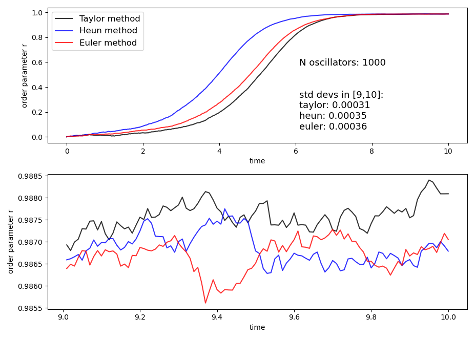
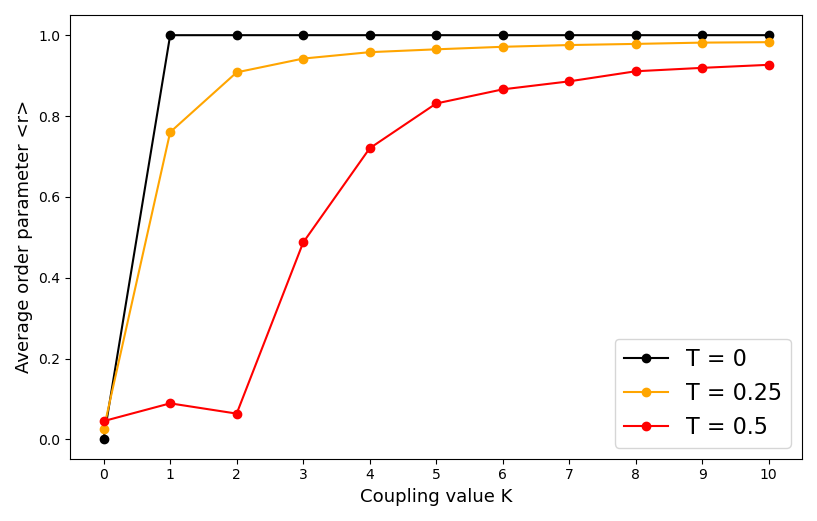
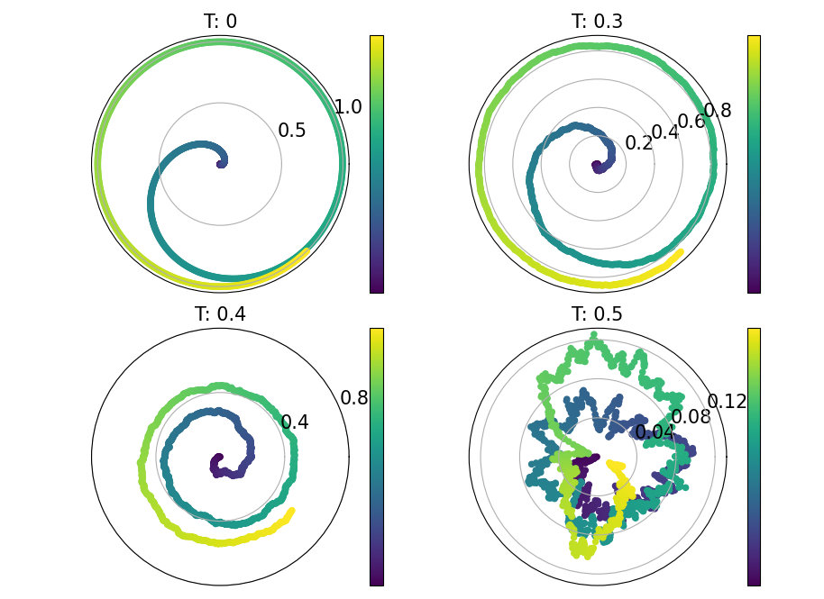

# The mean field Kuramoto model

The Kuramoto model (by Yoshiki :japanese_ogre: Kuramoto :japanese_goblin:) describes a large population of coupled limit-cycle oscillators, each with its natural frequency. If the coupling strength exceeds a 
certain threshold, the system exhibits a phase transition: some of the oscillators spontaneously synchronize, while others remain incoherent. Due to this 
emergent property, this model and its numerous variations are the main paradigm for synchronization phenomena. The model has been introduced back in 1975 but 
still today it proves to be an useful and surprising mathematical challenge, that keeps stimulating new advancements in the field.
  
  
The goverining system of equations of the model is the following:  

A lot of further informations can be found in the report available in the repository.

### Connections to complexity
The main feature of the model is the emergence of synchronization, what is called an **emergent property** in the field of **complex systems**. Being also a paradigmatic 
example of a **non-linear dynamical system**, the issues related to the **stability** of the solutions retain a big importance too. It is fundamental also the introduction 
of **stochastic fluctuations** in the model, that lead to the **Fokker Planck equation** in the large population limit. The analysis of the mean field Kuramoto model
passes through the identification of a **control parameter** (the coupling k in this case) and the study of its effect onto an **order parameter**. The order parameter 
somehow quantifies the emergent property and it has a central role in the analysis.
  
## Some figures  

Stochastic dinamical evolution, as integrated by some stochastic numerical schemes:  

  
  
Parameter analysis, in order to spot the rise of synchronization and identify the critical value for the order parameter, all in presence of noise:  

  
  
Some polar plots in the complex plane, always cool:  

  
  
  
:japanese_goblin: Enjoy! :japanese_ogre:
    
